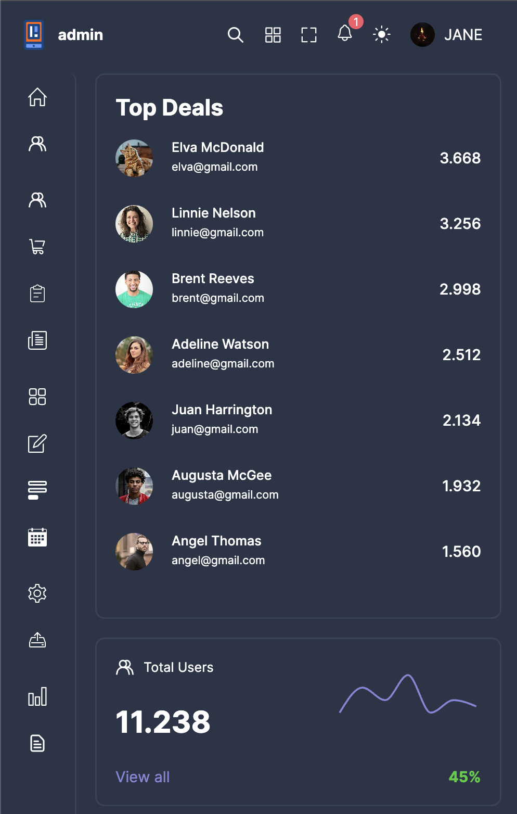

#### Theme

Dark

Light


Used `documentElement.setAttribute()` to control theme for make things simple

```javascript
const [isDark, setIsDark] = useState(false);

const toggleTheme = () => {
  setIsDark(!isDark);
  document.documentElement.setAttribute(
    "data-theme",
    isDark ? "dark" : "light"
  );
};
```

SCSS

```scss
// ./variables.scss - Theme
$theme-light: (...);

$theme-dark: (...);

// ./global.scss - Usage
:root {
  @each $key, $value in $theme-light {
    --#{$key}: #{$value};
  }
}

[data-theme="dark"] {
  @each $key, $value in $theme-dark {
    --#{$key}: #{$value};
  }
}
```

#### Responsive

<div style="display:flex; justify-content:space-between; align-items:center">
  
  
  
</div>
<div style="display:flex; justify-content:space-between; align-items:center;">
  
  
  
</div>

```scss
$sm: 480px;
$md: 768px;
$lg: 1024px;
$xl: 1200px;
$xxl: 1400px;

@mixin sm {
    @media screen and (max-width:($sm)) {
        @content;
    }
}

@mixin md {
    @media screen and (max-width:($md)) {
        @content;
    }
}
...
```
